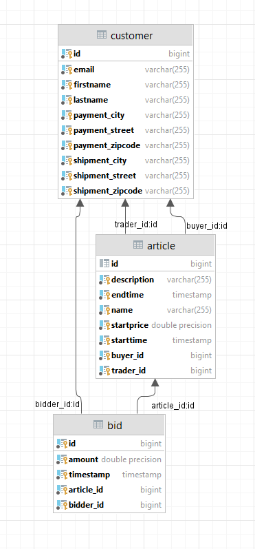
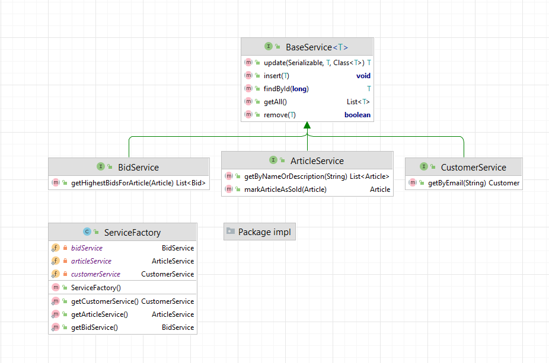
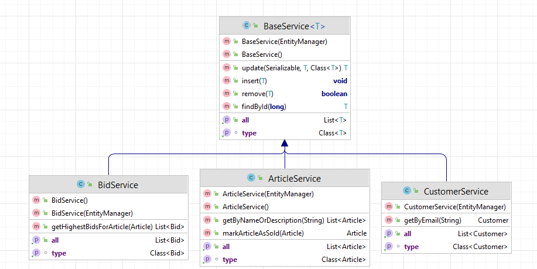
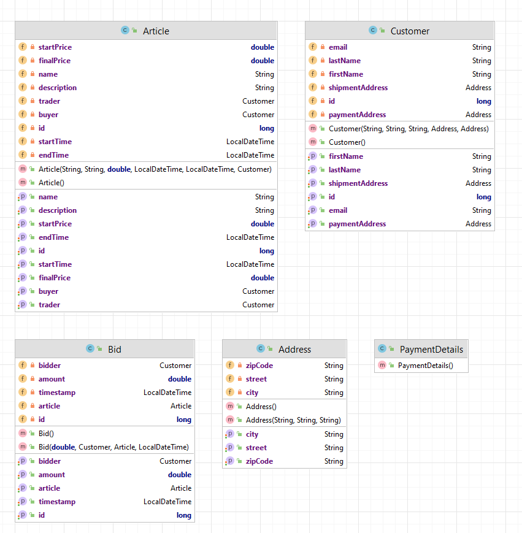

# Datenbank starten
```
docker run --name fhbay --rm -e POSTGRES_USER=postgres -e POSTGRES_PASSWORD=postgres -e POSTGRES_DB=FHBay -p 5432:5432 -it postgres:14.1-alpine
```
# Datenbankdiagram


# Interfaces Service


# Services Implementierung


# Domain

